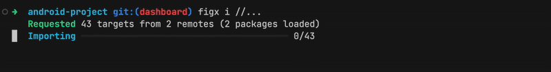
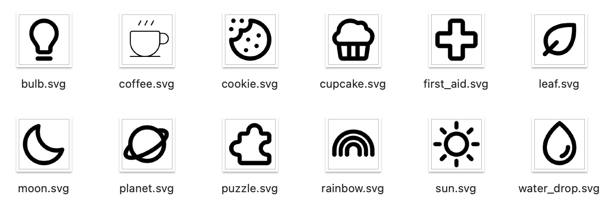
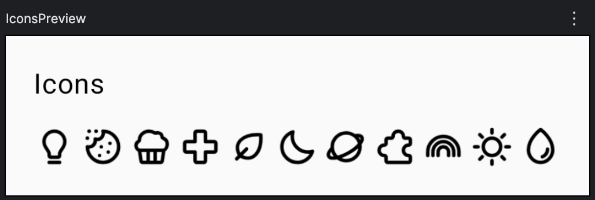

<p align="center">


</p>

# FigX - Pragmatic Design Asset Management

FigX is a no-nonsense CLI tool for importing design assets from Figma into your codebase. Built for developers who value explicit control and reproducibility. 

> 🚧 The project is in the active development phase 🚧

[**📚 See full documentation**](https://tonykolomeytsev.github.io/figx) • [**🚀 GitHub Action Available**](https://github.com/marketplace/actions/figx-action) • [**🐳 Docker Image Available**](https://github.com/tonykolomeytsev/figx/pkgs/container/figx)



<!-- <p align="center">

</p> -->

# Features

At a high level, FigX is a straightforward and reliable CLI tool designed for:
- 🔁 Deterministic and reproducible imports
- 🔧 Seamless integration into CI/CD pipelines
- 💻 Cross-platform support: macOS, Windows, and Linux

## Importing graphic resources

FigX comes with built-in import profiles for various formats, enabling immediate use without additional setup:

| Profile | Description |
| --- | --- |
| `android-webp` | 1. Downloads PNG variants for themes (`night`/`light`) and screen densities (`hdpi`, `xhdpi`, etc.)<br> 2. Converts all variants to WebP using [libwebp](https://developers.google.com/speed/webp)<br> 3. Places the resulting images into the appropriate `drawable-*` directories for Android |
| `compose` | 1. Downloads SVG from Figma<br> 2. Simplifies SVG using [usvg](https://github.com/linebender/resvg/tree/main/crates/usvg)<br> 3. Converts to `ImageVector` for Jetpack Compose |
| `webp` | 1. Downloads PNG from Figma<br> 2. Converts PNG to WebP using [libwebp](https://developers.google.com/speed/webp) |
| `png` | Downloads PNG assets directly from Figma |
| `svg` | Downloads SVG assets directly from Figma | 
| `pdf` | Downloads PDF assets directly from Figma | 

> Profiles `png`, `svg`, `pdf` and `compose` support matrix-like import configurations — multiple variants (e.g. `light`/`night`, sizes `16`/`20`/`24`) for a single resource, similar to GitHub Actions matrices.

## Help in resource control

FigX can show you which resources are already declared in the project, which packages/modules exist, or what flow specific resources follow during import before they are included in the project.

List all **figx resources** in the project without importing them:

```bash
figx query //...
```

List all **figx packages** in the project:

```bash
figx query -o package //...
```

Explain the import flow for specific resources:

```bash
figx explain //.../ui/icons:Sun
```

Example output:

```text
//app/src/main/java/com/example/figxdemo/ui/icons:Sun
├── 📤 Export SVG from remote @icons/MhjeA23R15tAR3PO2JamCv
│      ┆ node: Environment / Sun
│      ┆ scale: 1
├── ✨ Transform SVG to Compose
│      ┆ package: com.example.figxdemo.ui.icons
╰── 💾 Write to file
       ┆ output: Sun.kt
```

# Quick Start

## Install

### For MacOS

The easiest way to install on macOS is via Homebrew:

```bash
brew tap tonykolomeytsev/figx
brew install figx
```

### For Windows

Download the latest `.msi` installer from the [releases page](https://github.com/tonykolomeytsev/figx/releases/latest), then run the installer to complete the setup.

### For Linux

Follow the detailed installation instructions available in the [documentation](https://tonykolomeytsev.github.io/figx/user_guide/1-installation.html).

## Run your first import

### Minimal example with FigX

1. Clone this repository and open it in terminal.
2. Go to [examples/multiple-svg-icons](https://github.com/tonykolomeytsev/figx/tree/master/examples/multiple-svg-icons)
   ```bash
   cd examples/multiple-svg-icons
   ```
3. [Get temporary access token](https://www.figma.com/developers/api#access-tokens) for Figma and add it to your env:
   ```bash
   export FIGMA_PERSONAL_TOKEN="<token from url above>"
   ```
4. Run import and wait for complete
   ```bash
   figx import //...
   ```
5. You will get the result:<br>
   


### Android project with FigX

> The example demonstrates importing icons in the Compose `ImageVector` format and importing illustrations in the WEBP format for different screen densities (from `hdpi` to `xxxhdpi`).

1. Clone this repository and open it in terminal.
2. Go to [examples/android-project](https://github.com/tonykolomeytsev/figx/tree/master/examples/android-project)
   ```bash
   cd examples/android-project
   ```
3. [Get temporary access token](https://www.figma.com/developers/api#access-tokens) for Figma and add it to your env:
   ```bash
   export FIGMA_PERSONAL_TOKEN="<token from url above>"
   ```
4. Run import and wait for complete
   ```bash
   figx import //...
   ```
5. You will get the result:<br>
   | Compose ImageVector | Android Drawable WEBP |
   | --- | --- |
   |  <br> [**See the generated Kotlin code for the icons**](https://github.com/tonykolomeytsev/figx/tree/master/examples/android-project/app/src/main/java/com/example/figxdemo/ui/icons) |  |


# Documentation
Full documentation available at: [tonykolomeytsev.github.io/figx](https://tonykolomeytsev.github.io/figx)

# Differences from [figma-export](https://github.com/RedMadRobot/figma-export)

The figma-export tool was the catalyst for creating this project. FigX draws inspiration from its predecessor but completely reimagines the resource processing approach, incorporating lessons learned from negative experiences with figma-export.

Key distinctions between the tools:

| **figma-export** | **figx** |
| --- | --- |
| macOS-only | Cross-platform: runs on macOS, Windows, Linux. Easily compilable for other platforms |
| Requires external graphic tools for Android assets (vd-tool, cwebp) | Built-in libwebp for WEBP compression and native SVG-to-Android vector conversion without Java-based vd-tool legacy |
| No Jetpack Compose `ImageVector` support | Generates native `ImageVector` graphics as ready-to-use Kotlin code |
| Resource imports determined by Figma file contents or CLI arguments | Granular resource specification via dedicated manifest files per project package/module |
| Limited built-in import profiles (icons/illustrations) without project domain consideration | Extensible profile system supporting unlimited custom profiles with configurable import flows and identifiers |
| Complex multi-module resource targeting - tends toward hardcoded monolithic output directories | Designed for modular projects - immune to refactoring and path changes through proper package isolation |
| Optimized primarily for local developer use | CI-optimized with aggressive caching to minimize resource waste in pipelines |

# License

GPL-3.0 license © 2025 Anton Kolomeytsev
