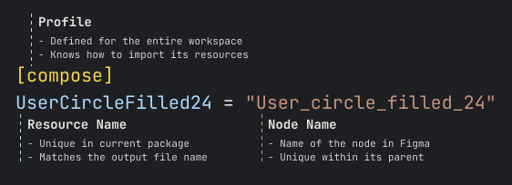

# Fig-files

## Fig-file (`.fig.toml`)
*Package root marker and resources list*

A fig-file (`.fig.toml`) is a configuration file used within a FigX package to declare which design resources should be imported from Figma, and how they should be processed. Each fig-file is specific to a package and typically lives inside a subdirectory of the workspace.

This file defines which resources (e.g., icons, logos, illustrations) should be downloaded, what format they should be exported in, and allows fine-grained control over how each asset is handled.

### Profile-Based Sections

Resources are grouped by format, using TOML tables like `[png]`, `[webp]`, or `[android-drawable-xml]`. Each section tells FigX which assets to export in that specific profile.

For example:

```toml
[png]
ic_nemo = "XEM"
```

**This means:** The resource `ic_nemo` will use the `png` profile, pulled from the Figma node named "XEM" and then saved with name `ic_nemo.png`, and using the default profile settings (scale/output_dir/etc.).



### What is a "fig-file"?
- A fig-file maps local resource names (like `ic_tron`) to Figma node names (like "TRX")
- It also assigns a processing profile to each group of resources
- This gives you fine control over how assets are imported on a per-package basis

### Per-Resource Profile Overrides
You can override profile properties for individual resources directly in the `.fig.toml` file. These overrides can include any fields supported by the profile.

**Example:**
```toml
[svg]
ic_iost = { name = "IOST", scale = 4.0, output_dir = "legacy" }
```

Here, the `ic_iost` resource:
- Uses the `svg` profile, image will saved to `{package_dir}/legacy/ic_iost.svg`
- Pulls the image from the Figma node named "IOST"
- Is exported at 4.0x scale, overriding the default scale in the profile

## Why You *Can’t* Override Profiles at the Package Level
FigX intentionally does not allow overriding profiles for an entire package in the `.fig.toml` file. This is **by design**.

Allowing global profile overrides at the package level would introduce hidden behavior and make it much harder to understand how resources are actually processed. It becomes difficult to trace what’s coming from where, especially in larger monorepos.

> Experience has shown that such flexibility often leads to chaos—confusing overrides, inconsistent exports, and "spaghetti configuration". Projects start to drift apart in terms of conventions and structure.

This restriction prevents misuse—particularly by those with an "OOP brain" tendency to over-abstract and over-engineer configuration through excessive inheritance. Instead of building fragile, implicit hierarchies, FigX favors **explicit and local control**:
you override what you need, where you need it — resource by resource. This keeps things, predictable, easy to trace, less error-prone.

In short: no magic behind the scenes, even in FigX.
